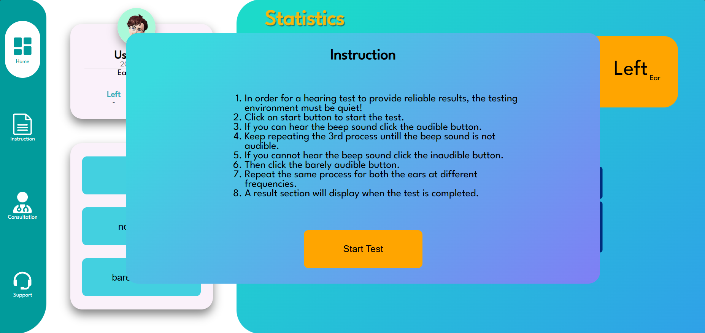
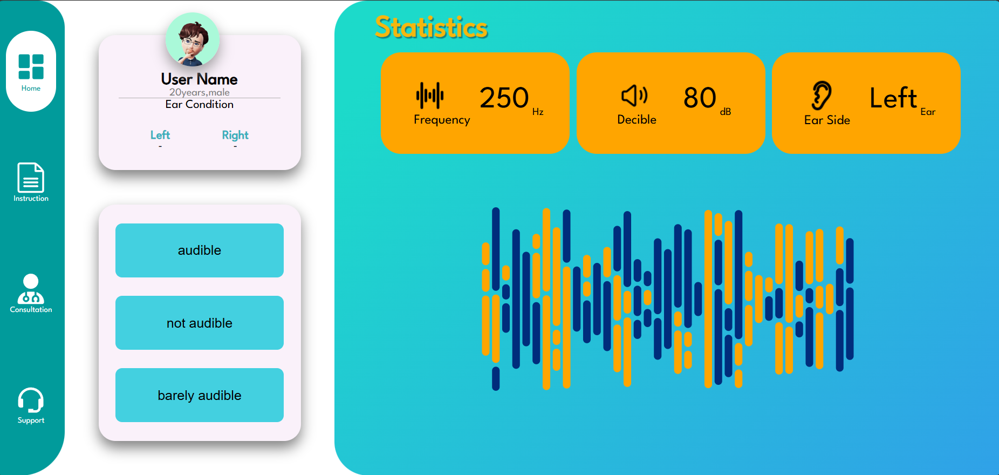
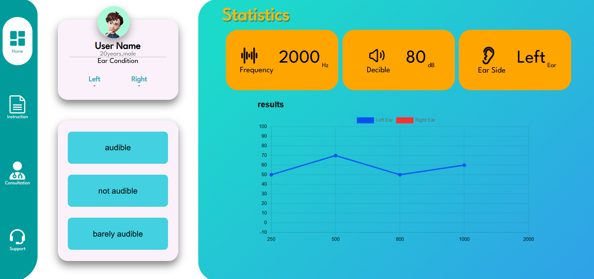
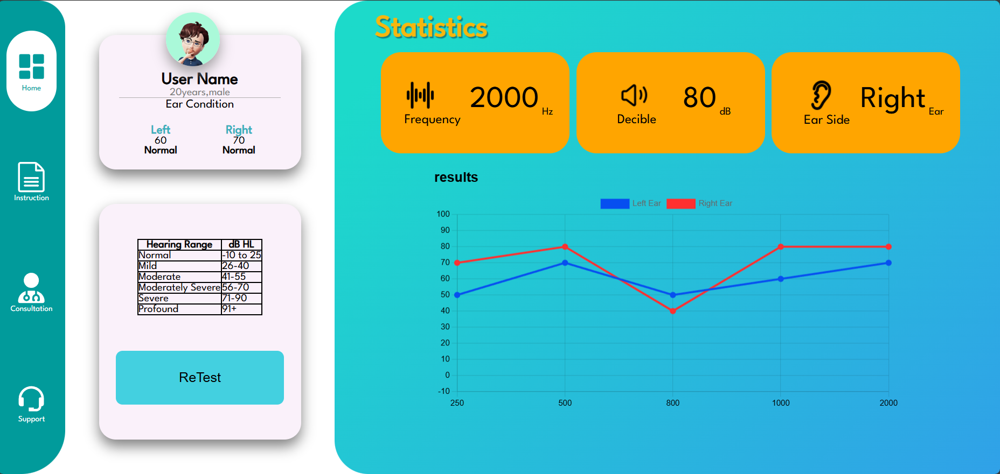

# [Digital Audiometer - Web Version](https://digital-audimeter.vercel.app/)

This project is a web-based digital audiometry platform developed as part of **SIH 2023**. It helps users assess their hearing ability by generating audio samples at different frequencies and intensities.

### Table of Contents
- [How to Use](#how-to-use)
- [Audiometer Functionality](#audiometer-functionality)
- [Left and Right Ear Frequency Testing](#left-and-right-ear-frequency-testing)
- [Results](#results)
- [React Native Version](#react-native-version)

## How to Use

On the first page, you will find a simple guide on how to perform the hearing test and interact with the platform.

## Audiometer Functionality

The second page contains the core audiometry functionality where users with hearing impairments can input their hearing responses to the audio samples.

## Left and Right Ear Frequency Testing

The audiometer allows users to test their hearing ability in **both ears** independently by generating audio samples at different frequencies for the left and right ear. During the test, the user will hear sound samples at various frequencies in one ear at a time. They can input their response based on their perception of the sound.

Below are examples of frequency testing for the left and right ear:

- **Left Ear Sample at 1000 Hz**:
  

- **Right Ear Sample at 800 Hz**:
  

These tests help to determine if the user has a hearing loss in one ear or both, and at which frequencies.

## Results

After completing the test, the results page will generate an audiogram, showing the user's hearing sensitivity at various frequencies.

## React Native Version

Check out the [React Native Version of this project](https://github.com/your-react-native-repo-link) for mobile users.
